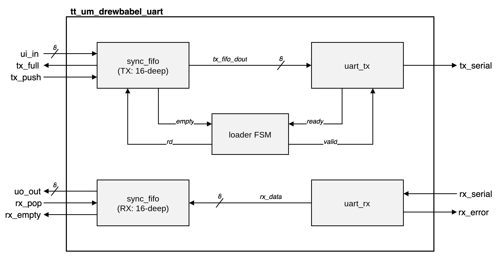
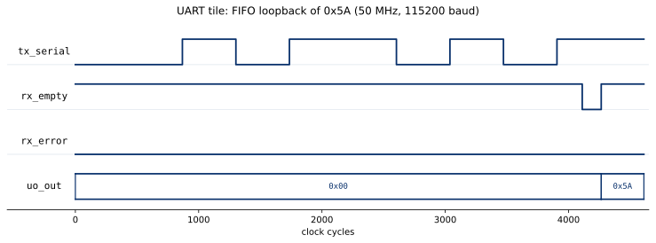
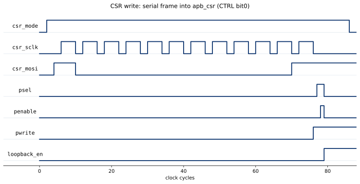

   

# tinytapeout-uart

A configurable UART with transmit and receive FIFOs and a memory-mapped register block, hardened for the Tiny Tapeout SKY130 (ttsky26c) shuttle.

The transmitter serializes a parallel byte behind start and stop bits (8N1, with optional parity). The receiver oversamples the incoming line at 16x, recovers each byte with mid-bit sampling, and flags framing and parity errors. A `tick_gen` divides the 50 MHz system clock down to the baud rate and the receiver's oversample rate. A two-flop `synchronizer` guards the asynchronous receive line against metastability, giving a clock-mismatch tolerance of about +/-4%.

A 16-deep `sync_fifo` on each path decouples the host from the serial timing, so the host bursts bytes in through `tx_push` and drains them out through `rx_pop` without tracking the UART cycle by cycle. A small loader FSM hands buffered bytes from the TX FIFO to `uart_tx` whenever the transmitter is ready, and received bytes flow from `uart_rx` into the RX FIFO. The whole tile is pin-muxed onto the Tiny Tapeout `ui`/`uo`/`uio` bus.

A memory-mapped register block makes the tile programmable at runtime over the pins it already has. A `csr_pin_adapter` shifts a 12-bit frame of a read/write bit, an address, and a data byte in over three reused pins, then drives it as one AMBA-APB transaction into `apb_csr`, a small APB-slave register file. The registers turn on an internal loopback so the tile can exercise itself with no host, select even or odd parity, set a runtime baud divisor, and expose the FIFO status flags for readback.



## Pin map

| Signal | Direction | Width | Description |
|--------|-----------|-------|-------------|
| `ui[7:0]` | in | 8 | `tx_data`, byte to enqueue for transmit (`ui[0]` doubles as `csr_mosi` in CSR mode) |
| `uio[0]` | in | 1 | `rx_serial`, receive line (idle high) |
| `uio[1]` | in | 1 | `tx_push`, pulse to push `ui_in` into the TX FIFO (doubles as `csr_sclk` in CSR mode) |
| `uio[2]` | in | 1 | `rx_pop`, pulse to pop a byte from the RX FIFO |
| `uio[7]` | in | 1 | `csr_mode`, hold high to shift a CSR frame in |
| `uo[7:0]` | out | 8 | `rx_data`, RX FIFO read data, or CSR read data during a register read |
| `uio[3]` | out | 1 | `tx_serial`, transmit line (idle high) |
| `uio[4]` | out | 1 | `tx_full`, TX FIFO full |
| `uio[5]` | out | 1 | `rx_empty`, RX FIFO empty |
| `uio[6]` | out | 1 | `rx_error`, framing or parity error |

## Configuration registers

The register block is an AMBA-APB slave. A full parallel bus will not fit the one spare pin, so the host shifts each transaction in serially. It holds `csr_mode` high and clocks a 12-bit frame on `csr_sclk`, MSB first, with each bit on `csr_mosi`. The frame carries one read/write bit, then a 3-bit address, then a byte of data. The adapter synchronizes the asynchronous shift clock into the tile domain, assembles the frame, and issues a single APB access. A read returns its byte on `uo_out`.

| Addr | Name | Access | Contents |
|------|------|--------|----------|
| 0 | `CTRL` | R/W | bit0 `loopback_en`, bit1 `parity_en`, bit2 `parity_odd` |
| 1 | `STATUS` | R | `rx_error`, `rx_empty`, `tx_empty`, `tx_full` in bits `[3:0]` |
| 2 | `SCRATCH` | R/W | 8-bit scratch register |
| 3 | `BAUD_LO` | R/W | baud divisor `[7:0]` |
| 4 | `BAUD_HI` | R/W | baud divisor `[15:8]` |

## Clock and area

Hardened at 50 MHz (`clock_hz: 50000000`, `CLOCK_PERIOD: 20`), giving `ClksPerBit = 434` at 115200 baud. The design occupies a 1x2 tile. The pins fit a single tile, but the two 16-deep FIFOs push a 1x1 over utilization.

## Verification

| Test | Method |
|------|--------|
| `test/test.py` | 100-byte randomized self-checking loopback plus a framing-error case (top level) |
| `test/csr` | APB register block driven directly, plus a serial-frame to APB round-trip through the adapter |
| `test/uart` | parity (even and odd, good and error) and a runtime baud divisor through loopback |

Run from `test/`:

```
make                             # top-level cocotb tests
make GATES=yes                   # gate-level simulation against the hardened netlist
make -C csr                      # CSR register block (isolation)
make -C csr -f Makefile.adapter  # CSR serial adapter plus register block (integration)
make -C uart                     # parity and runtime baud
```

## Results

A byte pushed into the TX FIFO is shifted out on `tx_serial` as an 8N1 frame, recovered by the receiver into the RX FIFO, and read back on `uo_out`.



A serial CSR write shifts a 12-bit frame in on `csr_sclk` and `csr_mosi`, and the adapter drives one APB write into the register block.



## Resources

- [Tiny Tapeout](https://tinytapeout.com)
- [FAQ](https://tinytapeout.com/faq/)
- [Submit your design to a shuttle](https://app.tinytapeout.com/)
